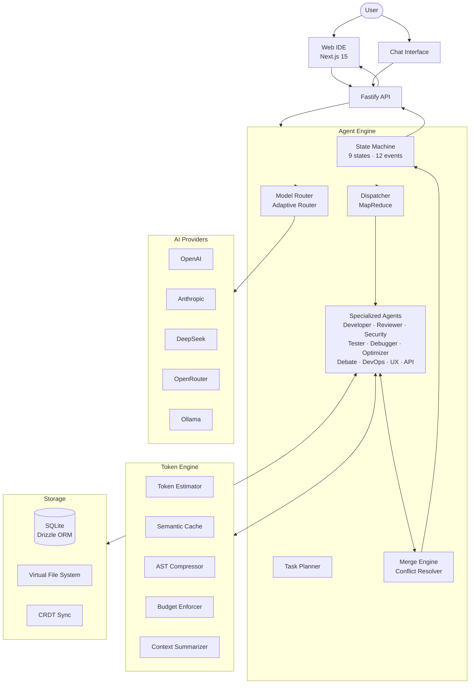
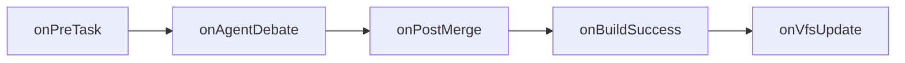
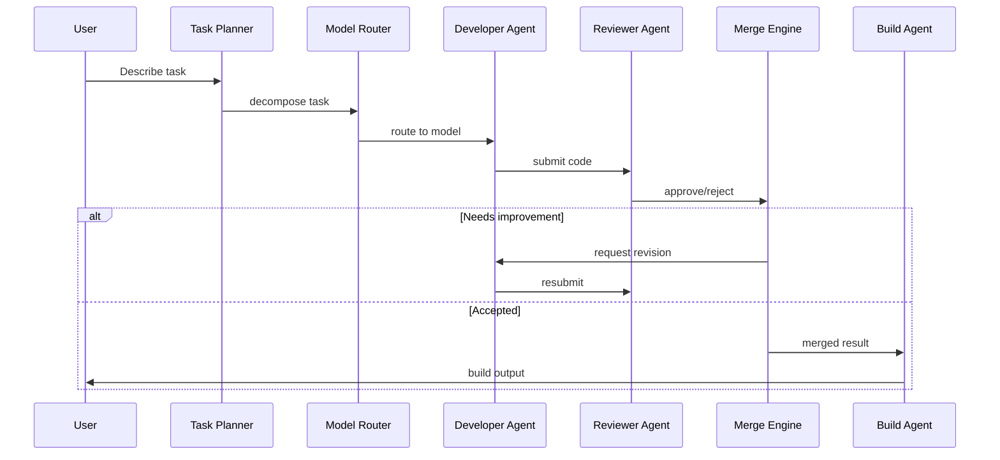

# Zenthorix

**AI-powered software engineering platform — build, debug, and deploy applications through natural language conversations with autonomous agents.**

[](LICENSE)
[](https://www.typescriptlang.org)
[](https://nextjs.org)
[](https://turbo.build)
[](https://pnpm.io)
[](CONTRIBUTING.md)

---

## Introduction

Zenthorix is an open-source, AI-native development environment. Instead of writing code line by line, you describe what you want in natural language and a team of autonomous AI agents plans, implements, reviews, tests, and deploys it.

**Why Zenthorix?**

- **Multi-agent orchestration** — Specialized agents (planner, developer, reviewer, security, tester, debugger, devops) collaborate on tasks, debate solutions, and merge results.
- **Provider-agnostic** — Swap between OpenAI, Anthropic, DeepSeek, OpenRouter, or local models via Ollama without changing your workflow.
- **Built for extensibility** — Plugin hooks at every lifecycle stage and a typed SDK for custom agents and integrations.
- **Token-aware** — Semantic caching, AST compression, budget enforcement, and context summarization keep API costs predictable.

Zenthorix is early-stage and evolving rapidly. Some UI surfaces render mock data while the underlying engine and services are production-grade.

---

## Features

| Category | Feature | Status |
|----------|---------|--------|
| **Multi-Agent AI** | Task planner, developer, reviewer, debugger, tester, security scanner, optimizer, debater, devops, UX, API consumption, custom agent | Implemented |
| **Multi-Agent AI** | State machine with 9 states, 12 events, guardrails | Implemented |
| **Multi-Agent AI** | Agent memory manager (short-term, capped at 100 entries) | Implemented |
| **Multi-Agent AI** | MapReduce for parallel task execution | Implemented |
| **Multi-Agent AI** | Model routing by task complexity and context window | Implemented |
| **Multi-Agent AI** | CVE dependency scanner | Implemented |
| **Multi-Agent AI** | Release changelog generator from conventional commits | Implemented |
| **AI Providers** | OpenAI (generate + stream) | Implemented |
| **AI Providers** | Anthropic / Claude (generate + stream) | Implemented |
| **AI Providers** | DeepSeek (generate + stream) | Implemented |
| **AI Providers** | OpenRouter (generate + stream) | Implemented |
| **AI Providers** | Ollama / local models (generate + stream + listModels) | Implemented |
| **AI Providers** | Unified provider interface via `@zenthorix/provider-sdk` | Implemented |
| **Token Optimization** | Token estimation and cost calculation per model | Implemented |
| **Token Optimization** | Daily budget enforcement with cost tracking | Implemented |
| **Token Optimization** | Semantic cache (TTL-based, max 1,000 entries) | Implemented |
| **Token Optimization** | AST compression (structural code extraction) | Implemented |
| **Token Optimization** | Context summarization (old-message truncation) | Implemented |
| **Token Optimization** | Prompt optimization (whitespace normalization, minification) | Implemented |
| **Token Optimization** | Knowledge ingestion (file chunking, 512-token windows) | Implemented |
| **Token Optimization** | Retrieval engine (keyword-based, top-K scoring) | Implemented |
| **Plugin System** | Plugin interface with 5 lifecycle hooks | Implemented |
| **Plugin System** | Plugin registry (register, unregister, query by hook) | Implemented |
| **Plugin System** | Example linter plugin (auto-whitespace cleanup) | Implemented |
| **Plugin System** | Asset generator plugin interface | Interface only |
| **IDE** | File tree with expand/collapse, active file highlighting | Implemented |
| **IDE** | Virtual file system (read, write, delete, patch, snapshots, history) | Implemented |
| **IDE** | Code editor (textarea-based, no syntax highlighting) | Implemented |
| **IDE** | Multi-tab editor with dirty-file indicators | Implemented |
| **IDE** | Side-by-side diff viewer with accept/reject | Implemented |
| **IDE** | File history with snapshot comparison | Implemented |
| **IDE** | Drag-and-drop file upload | Implemented |
| **IDE** | Dark/light/system theme toggle | Implemented |
| **IDE** | Preview panel (iframe-based) | Implemented |
| **IDE** | File search panel | Implemented |
| **IDE** | Code format on save (JSON pretty-print, trailing newline) | Implemented |
| **IDE** | In-memory linter (debugger/var warnings) | Implemented |
| **Chat** | Chat interface with message bubbles | Mock |
| **Chat** | Streaming response simulation | Mock |
| **Chat** | Activity feed (agent actions) | Mock |
| **Chat** | Command palette (Cmd+K, file/build/theme/settings) | Implemented |
| **Chat** | Context inspector (full prompt view) | Implemented |
| **Terminal** | Tabbed multi-terminal UI | Implemented |
| **Terminal** | Command input with scrollable history | Mock |
| **Terminal** | Terminal session tracking (API) | Implemented |
| **Collaboration** | CRDT document sync (key-value, observer pattern) | Implemented |
| **Collaboration** | CRDT sync server (per-workspace broadcast) | Implemented |
| **Collaboration** | Remote cursor indicators | Implemented |
| **Collaboration** | Inline review comments (error/warning/info badges) | Implemented |
| **Collaboration** | Merge conflict detection and resolution | Implemented |
| **Collaboration** | Shared workspace state via Zustand stores | Implemented |
| **Deployment** | Vercel deploy service (project + deployment via API) | Implemented |
| **Deployment** | Docker security constraint builder | Implemented |
| **Deployment** | Git operations (branch creation, PR) via GitHub API | Implemented |
| **Deployment** | GitHub import (repository tree + file extraction) | Implemented |
| **Deployment** | Project scaffolding from templates (Next.js, Express) | Implemented |
| **Security** | AES-256-GCM encryption with scrypt key derivation | Implemented |
| **Security** | GitHub OAuth (NextAuth v5, JWT sessions) | Implemented |
| **Security** | Role-based access control (owner, admin, member, viewer) | Implemented |
| **Security** | Row-level security policies for conversations | Implemented |
| **Security** | API rate limiting (per-window bucket, 100/min default) | Implemented |
| **Security** | Secrets management and injection | Implemented |
| **Security** | API key storage (sessionStorage frontend, encrypted DB backend) | Implemented |
| **UX** | Notification center (global store, dropdown with badge) | Implemented |
| **UX** | Settings dialog (theme, API keys, budget) | Implemented |
| **UX** | Agent builder form (name, role, prompt, model) | Implemented |
| **UX** | Visual canvas (draggable nodes, React Flow-ready) | Stub |
| **UX** | Accessibility label constants | Implemented |
| **UX** | Panel error boundaries with reload | Implemented |
| **UX** | Branch selector (git mock) | Implemented |
| **UX** | Internationalization (en, es JSON files) | Data only |
| **Developer Tools** | Snippet manager (in-memory CRUD with search) | Implemented |
| **Developer Tools** | Knowledge base service (add, search, delete entries) | Implemented |
| **Developer Tools** | Search engine (full-text file search) | Implemented |
| **Developer Tools** | Coverage service (line/branch/function coverage) | Implemented |
| **Developer Tools** | Inline completion service (API client with cache) | Service only |
| **Developer Tools** | Public share service (snippets with TTL) | Implemented |
| **Developer Tools** | Voice input (MediaRecorder recording) | Implemented |
| **Developer Tools** | Offline detection with change subscription | Implemented |
| **Developer Tools** | Hibernation manager (session TTL, periodic cleanup) | Implemented |
| **Developer Tools** | Local auth service (SHA-256, fallback) | Implemented |
| **Developer Tools** | WebContainer service (StackBlitz-compatible API) | Stub |
| **Backend** | Fastify API server with CORS | Implemented |
| **Backend** | 21 API services (billing, build-runner, cache, git, webhooks, etc.) | Implemented |
| **Backend** | Drizzle ORM + SQLite (9 tables, indexes, cascade deletes) | Implemented |
| **Backend** | Event bus (typed publish-subscribe) | Implemented |
| **Backend** | Task cancellation | Implemented |
| **Testing** | Vitest unit test (session utility) | 1 test |
| **Testing** | Playwright e2e test (IDE + chat load) | 1 test |
| **Monitoring** | Usage analytics page (spend, tokens, charts) | Mock |
| **Monitoring** | System admin page (connections, queue, memory) | Mock |
| **Monitoring** | Plugin marketplace page (install, search) | Mock |
| **Desktop** | Tauri scaffold (Cargo.toml, conf, lib.rs) | Implemented |
| **Database** | User, account, session, API keys, conversations, messages, VFS snapshots, prompt cache | Implemented |

---

## Screenshots

```
[Dashboard]              [Chat Interface]         [IDE Workspace]
    ┌──────┐               ┌──────┐                 ┌──────┐
    │ Mock │               │ Mock │                 │      │
    │ grid │               │ chat │                 │ IDE  │
    │ of   │               │ bub- │                 │ with │
    │ proj │               │ bles │                 │ file │
    │ ects │               │      │                 │ tree │
    └──────┘               └──────┘                 └──────┘

[Settings Dialog]        [Plugin Marketplace]     [Visual Canvas]
    ┌──────┐               ┌──────┐                 ┌──────┐
    │Theme,│               │ Mock │                 │ Drag │
    │API   │               │ plugin│                 │-gable│
    │keys, │               │ list  │                 │nodes │
    │budget│               │       │                 │stub  │
    └──────┘               └──────┘                 └──────┘
```

> Note: Dashboard, Chat, Marketplace, and Canvas currently render mock data while the underlying agent engine and services are production-ready.

---

## Architecture



---

## Repository Structure

```
zenthorix/
├── apps/
│   ├── web/                        # Next.js 15 frontend (IDE, auth, pages)
│   │   ├── src/
│   │   │   ├── app/                # App Router pages (/, /login, /dashboard, /analytics, /admin, /marketplace)
│   │   │   ├── components/         # React components (editor, chat, terminal, explorer, settings, canvas, etc.)
│   │   │   ├── services/           # Client-side services (inline-completion, voice-input, webcontainer, etc.)
│   │   │   ├── lib/                # Utilities (session, stores, snippet-manager, a11y)
│   │   │   └── i18n/               # Internationalization JSON (en, es)
│   │   └── src-tauri/              # Tauri desktop scaffold (Cargo.toml, lib.rs)
│   └── api/                        # Fastify API server
│       └── src/
│           ├── index.ts             # Server entry (health, agents, workspaces routes)
│           └── services/           # 21 services (billing, git, github, build-runner, queue, etc.)
│
├── packages/
│   ├── core/                       # Shared logic
│   │   └── src/
│   │       ├── providers/          # AI provider implementations (OpenAI, Anthropic, DeepSeek, OpenRouter, Ollama)
│   │       ├── vfs/                # Virtual file system (read, write, patch, snapshots, history)
│   │       ├── crdt/               # CRDT document sync
│   │       ├── auth/               # RBAC (roles, permissions)
│   │       ├── stores/             # Zustand stores (workspace, appearance, keybindings)
│   │       ├── events/             # Typed event bus
│   │       ├── encryption.ts       # AES-256-GCM
│   │       ├── search-engine.ts    # Full-text search
│   │       ├── knowledge-base.ts   # Knowledge base service
│   │       ├── coverage-service.ts # Code coverage
│   │       └── conflict-resolver.ts# Merge conflict detection
│   │
│   ├── agent-engine/               # Multi-agent orchestration
│   │   └── src/
│   │       ├── agent.ts            # BaseAgent (template method: execute → doExecute)
│   │       ├── state-machine.ts    # 9-state FSM with guardrails
│   │       ├── planner-agent.ts    # Task decomposition
│   │       ├── developer-agent.ts  # Code generation
│   │       ├── reviewer-agent.ts   # Code review
│   │       ├── security-agent.ts   # Vulnerability scanning
│   │       ├── debugger-agent.ts   # Error diagnosis
│   │       ├── test-agent.ts       # Test generation
│   │       ├── optimizer-agent.ts  # Performance suggestions
│   │       ├── debate-agent.ts     # Proposal comparison
│   │       ├── merge-engine.ts     # Result merging
│   │       ├── adaptive-router.ts  # Model selection by context
│   │       ├── map-reduce.ts       # Parallel task execution
│   │       ├── memory-manager.ts   # Short-term memory (100 entries)
│   │       ├── cve-scanner.ts      # npm dependency CVE scan
│   │       ├── release-agent.ts    # Changelog generation
│   │       └── ...                 # DevOps, UX, API Consumption, Custom agents
│   │
│   ├── token-engine/               # Token optimization
│   │   └── src/
│   │       ├── token-estimator.ts  # Per-model token counting
│   │       ├── cost-estimator.ts   # Cost calculation
│   │       ├── budget-enforcer.ts  # Daily spend caps + context truncation
│   │       ├── semantic-cache.ts   # TTL-based response cache
│   │       ├── ast-compressor.ts   # Structural code compression
│   │       ├── summarizer.ts       # Context summarization
│   │       ├── prompt-optimizer.ts # Whitespace/filler removal
│   │       ├── knowledge-ingester.ts # File chunking
│   │       └── retrieval-agent.ts  # Keyword-based retrieval
│   │
│   ├── provider-sdk/               # Provider interface and base class
│   │   └── src/
│   │       ├── types.ts            # ChatCompletionMessage, ModelInfo, TokenUsage, etc.
│   │       ├── base-provider.ts    # Abstract BaseProvider
│   │       └── model-costs.ts      # Model cost map (8 models)
│   │
│   ├── plugin-sdk/                 # Plugin system
│   │   └── src/
│   │       ├── index.ts            # ZenthorixPlugin interface, PluginRegistry
│   │       └── asset-generator.ts  # AssetGeneratorPlugin interface
│   │
│   ├── plugins/                    # Concrete plugin implementations
│   │   └── src/
│   │       └── linter-plugin.ts    # Auto-linter (onPostMerge hook)
│   │
│   ├── database/                   # Database schema and client
│   │   └── src/
│   │       ├── schema.ts           # 9 tables (users, accounts, sessions, api_keys, etc.)
│   │       ├── index.ts            # createDbClient, seedDatabase
│   │       ├── rls-policies.ts     # Row-level security policies
│   │       └── seed.ts             # Database seed script
│   │
│   └── ui/                         # Shared React components
│       └── src/
│           └── components/
│               ├── button.tsx      # Polymorphic Button (primary/secondary/ghost, sm/md/lg)
│               └── theme-toggle.tsx# Dark/light theme toggle
│
├── docs/                           # Documentation
│   ├── MASTER.md                   # Project master plan
│   └── Architecture.md             # Architecture documentation
│
├── e2e/                            # Playwright end-to-end tests
├── scripts/                        # Build scripts (esbuild)
├── turbo.json                      # Turborepo pipeline configuration
└── package.json                    # Workspace root
```

---

## Technology Stack

| Layer | Technology |
|-------|-----------|
| **Frontend** | [Next.js 15](https://nextjs.org) (App Router, React 19), [Tailwind CSS v4](https://tailwindcss.com) |
| **Backend** | [Fastify](https://fastify.dev) (Node.js 22+, ESM) |
| **Database** | [SQLite](https://sqlite.org) via [Drizzle ORM](https://orm.drizzle.team) ([LibSQL](https://turso.tech/libsql)) |
| **State Management** | [Zustand](https://github.com/pmndrs/zustand) |
| **Authentication** | [NextAuth v5](https://next-auth.js.org) (beta) with GitHub OAuth, JWT sessions |
| **Build System** | [Turborepo](https://turbo.build) v2, [esbuild](https://esbuild.github.io) (packages), Webpack (Next.js) |
| **Package Manager** | [pnpm](https://pnpm.io) v10 with isolated linker |
| **Testing** | [Vitest](https://vitest.dev) (unit), [Playwright](https://playwright.dev) (e2e) |
| **Linting** | [ESLint](https://eslint.org) 9 + [typescript-eslint](https://typescript-eslint.io) |
| **AI Providers** | OpenAI, Anthropic, DeepSeek, OpenRouter, Ollama (via `@zenthorix/provider-sdk`) |
| **Desktop** | [Tauri](https://v2.tauri.app) v2 (scaffold) |
| **Deployment** | Vercel (via `VercelDeployService`) |

---

## Installation

### Prerequisites

- **Node.js** >= 22
- **pnpm** >= 10

```bash
# Install pnpm (if not already installed)
corepack enable && corepack prepare pnpm@10 --activate

# Clone
git clone https://github.com/Astitva8292/Zenthorix.git
cd Zenthorix

# Install dependencies
pnpm install

# Copy environment variables
cp .env.example .env
# Edit .env with your API keys
```

### Development

```bash
# Start the web app (Next.js dev server)
pnpm --filter=web dev
# Opens at http://localhost:3000

# Start the API server (in another terminal)
pnpm --filter=api dev
# Listens on http://localhost:3001
```

### Production Build

```bash
# Build all packages
pnpm build

# Or build selectively:
pnpm --filter=@zenthorix/provider-sdk build
pnpm --filter=@zenthorix/core build
pnpm --filter=@zenthorix/agent-engine build
pnpm --filter=@zenthorix/token-engine build
pnpm --filter=@zenthorix/database build
pnpm --filter=@zenthorix/plugin-sdk build
pnpm --filter=@zenthorix/ui build
pnpm --filter=web build
pnpm --filter=api build
```

All 9 packages build with zero errors.

---

## Configuration

### Environment Variables

| Variable | Required | Description |
|----------|----------|-------------|
| `AUTH_SECRET` | Yes | NextAuth encryption secret (generate via `openssl rand -base64 32`) |
| `AUTH_GITHUB_ID` | Yes | GitHub OAuth App client ID |
| `AUTH_GITHUB_SECRET` | Yes | GitHub OAuth App client secret |
| `NEXTAUTH_URL` | No | Defaults to `http://localhost:3000` |
| `DATABASE_URL` | No | Defaults to `file:local.db` |
| `ENCRYPTION_KEY` | No | AES-256 key (32 characters) for agent encryption |

### API Keys (Frontend)

API keys for AI providers are configured through the **Settings** dialog (gear icon in the IDE sidebar) and stored in `sessionStorage`:

- OpenAI
- Anthropic

Provider routing is handled by the `AdaptiveRouter` which selects the appropriate provider based on the model requested.

### Authentication

Authentication uses GitHub OAuth via NextAuth v5 with JWT sessions. The login page is at `/login`. Create a GitHub OAuth App at https://github.com/settings/developers and configure the callback URL as `http://localhost:3000/api/auth/callback/github`.

---

## Supported AI Providers

| Provider | Class | `generate()` | `stream()` | `listModels()` | Authentication |
|----------|-------|:---:|:---:|:---:|---------------|
| [OpenAI](https://openai.com) | `OpenAIProvider` | Yes | Yes | Yes | API key |
| [Anthropic](https://anthropic.com) | `AnthropicProvider` | Yes | Yes | No | API key (x-api-key) |
| [DeepSeek](https://deepseek.com) | `DeepSeekProvider` | Yes | Yes | No | API key |
| [OpenRouter](https://openrouter.ai) | `OpenRouterProvider` | Yes | Yes | Yes | API key |
| [Ollama](https://ollama.ai) | `OllamaProvider` | Yes | Yes | Yes | None (localhost) |

All providers extend `BaseProvider` from `@zenthorix/provider-sdk` and implement the `IZenthorixProvider` interface.

---

## Plugin System

Zenthorix plugins hook into the agent lifecycle at five points:



### Plugin Interface

```typescript
interface ZenthorixPlugin {
  name: string
  version: string
  hooks: PluginHook[]
  onPreTask?(context: TaskContext): Promise<void>
  onAgentDebate?(proposals: Proposal[]): Promise<Proposal[]>
  onPostMerge?(merged: Output): Promise<Output>
  onBuildSuccess?(result: BuildResult): Promise<void>
  onVfsUpdate?(update: VfsUpdate): Promise<void>
}
```

### Plugin Registry

```typescript
class PluginRegistry {
  register(plugin: ZenthorixPlugin): void
  unregister(name: string): void
  get(name: string): ZenthorixPlugin | undefined
  getAll(): ZenthorixPlugin[]
  getByHook(hook: PluginHook): ZenthorixPlugin[]
}
```

### Building a Plugin

```typescript
import { ZenthorixPlugin, PluginRegistry } from '@zenthorix/plugin-sdk'

const myPlugin: ZenthorixPlugin = {
  name: 'my-plugin',
  version: '1.0.0',
  hooks: ['onPostMerge'],
  async onPostMerge(output) {
    // Transform output here
    return output
  },
}

const registry = new PluginRegistry()
registry.register(myPlugin)
```

An example `LinterPlugin` (auto-whitespace cleanup on `onPostMerge`) is provided in `packages/plugins/`.

---

## Multi-Agent Workflow



The `AgentStateMachine` enforces this flow with 9 states (`idle → planning → proposing → reviewing → merging → building → debugging → success | error`) and guardrails including a maximum of 5 review cycles.

---

## Token Optimization

| Component | Description |
|-----------|-------------|
| **Token Estimator** | Counts tokens per model using model-specific encoding assumptions |
| **Cost Estimator** | Calculates cost per request using per-model input/output rates |
| **Budget Enforcer** | Tracks daily accumulated cost and truncates context when approaching limits |
| **Semantic Cache** | Caches query-response pairs with TTL expiration (30 min, max 1,000 entries) |
| **AST Compressor** | Extracts structural signatures (imports, type definitions, function signatures) from source code, targeting 1,000→50 line compression |
| **Context Summarizer** | Preserves system prompt and most recent messages while summarizing older history |
| **Prompt Optimizer** | Normalizes whitespace, minifies JSON, removes filler words |
| **Knowledge Ingestion** | Splits files into 512-token overlapping chunks for retrieval |
| **Retrieval Engine** | Keyword-based chunk retrieval with top-K scoring by term overlap |

---

## Security

| Layer | Implementation |
|-------|---------------|
| **Encryption** | AES-256-GCM with scrypt key derivation. `encrypt(text)` / `decrypt(encoded)` functions in `@zenthorix/core` |
| **Authentication** | GitHub OAuth via NextAuth v5, JWT sessions with custom callback |
| **Authorization** | RBAC with 4 roles (owner, admin, member, viewer) and granular permissions (`read`, `write`, `delete`, `manage_members`, `manage_billing`, `dispatch_agents`) |
| **Row-Level Security** | RLS policies enforce per-user data isolation on conversations table |
| **Rate Limiting** | In-memory windowed bucket limiter (100/min standard, 20/min for agent endpoints) |
| **Secrets Management** | Encrypted API key storage in database (`api_keys` table), sessionStorage for frontend |
| **Docker Security** | Per-phase resource constraints (memory, CPU, timeout, network policies) |

---

## Performance

- **Streaming** — All AI providers support `AsyncIterable<string>` streaming for real-time token delivery.
- **Semantic Cache** — Repeated queries return cached responses, avoiding redundant API calls.
- **AST Compression** — Reduces code context by ~95% (1,000 → 50 lines) via structural extraction.
- **Virtual File System** — In-memory file operations with snapshot-based history (max 20 snapshots).
- **Selective Context** — Only active file content is sent in full; compressed signatures for inactive files.
- **Budget Enforcement** — Prevents runaway costs by truncating context and capping daily spend.
- **Adaptive Routing** — Routes requests to models with sufficient context window, reducing fallback retries.

---

## Development

```bash
# Build all packages
pnpm build

# Start web dev server
pnpm --filter=web dev

# Start API dev server
pnpm --filter=api dev

# Lint all packages
pnpm lint

# Type-check all packages
pnpm typecheck

# Run tests
cd apps/web && pnpm vitest run    # Unit tests
cd e2e && pnpm playwright test    # E2E tests

# Clean build artifacts
pnpm clean
```

---

## Roadmap

### Completed

- [x] Multi-agent engine with 12 agent types and state machine
- [x] 5 AI provider implementations (OpenAI, Anthropic, DeepSeek, OpenRouter, Ollama)
- [x] Provider SDK with unified interface and cost model map
- [x] Token optimization engine (estimation, caching, compression, budget, summarization)
- [x] Plugin SDK with lifecycle hooks and registry
- [x] Database schema with Drizzle ORM (9 tables, RLS, cascade deletes, indexes)
- [x] Virtual file system with snapshot history
- [x] AES-256-GCM encryption
- [x] RBAC with 4 roles and permission matrix
- [x] NextAuth v5 with GitHub OAuth and JWT sessions
- [x] CRDT document sync with broadcast server
- [x] Merge conflict detection and resolution
- [x] Notification center with global store
- [x] Inline code review comments
- [x] Side-by-side diff viewer
- [x] i18n data files (en, es)
- [x] Tauri desktop scaffold
- [x] Fastify API with 21 services
- [x] 9/9 Turbo tasks building with zero errors
- [x] Monorepo with pnpm + Turborepo

### In Progress

- [ ] Wiring i18n runtime into UI components
- [ ] Syntax highlighting in code editor (CodeMirror / Monaco)
- [ ] Real terminal emulation (xterm.js)
- [ ] WebContainer integration for in-browser execution
- [ ] Real-time collab (operational transform)
- [ ] Comprehensive test suite
- [ ] CI/CD pipeline (GitHub Actions)

### Planned

- [ ] Visual canvas with React Flow
- [ ] Plugin marketplace with install flow
- [ ] Voice transcription (speech-to-text)
- [ ] Vector database for knowledge base retrieval
- [ ] Desktop builds via Tauri
- [ ] Deployment presets (Vercel, Docker, AWS)
- [ ] Agent memory persistence to database
- [ ] Multi-workspace support
- [ ] VS Code extension

---

## FAQ

**Does Zenthorix replace my IDE?**
No. Zenthorix is a complementary platform that runs in the browser (or as a Tauri desktop app). It provides an agent-assisted development environment alongside your existing tools.

**Can I use my own API keys?**
Yes. API keys for OpenAI and Anthropic are configured through the Settings dialog. The app also supports OpenRouter (which provides access to many models with a single key) and local models via Ollama.

**Does it work without an internet connection?**
Partially. The IDE itself (file tree, editor, terminal UI) works offline. AI features require API access to one of the supported providers. Ollama can run entirely locally.

**What models are supported?**
Any model available through OpenAI, Anthropic, DeepSeek, OpenRouter, or Ollama. The `AdaptiveRouter` selects the appropriate provider based on the model name and task complexity.

**Can I build my own agent?**
Yes. Use the `CustomAgent` class or extend `BaseAgent` and override `doExecute()`. Custom agents can be registered with the engine and invoked by name.

**Is there a hosted version?**
Not yet. Zenthorix is self-hosted. Deployment services (Vercel, Docker) are available as code-level integrations but no hosted platform exists.

---

## License

[MIT](LICENSE)

---

## Acknowledgements

Zenthorix builds on the work of many open-source projects:

- [Next.js](https://nextjs.org) and [React](https://react.dev) — Frontend framework
- [Turborepo](https://turbo.build) — Monorepo orchestration
- [pnpm](https://pnpm.io) — Package management
- [Drizzle ORM](https://orm.drizzle.team) — Database toolkit
- [NextAuth.js](https://next-auth.js.org) — Authentication
- [Fastify](https://fastify.dev) — Node.js web framework
- [Zustand](https://github.com/pmndrs/zustand) — State management
- [Tailwind CSS](https://tailwindcss.com) — Utility-first CSS
- [esbuild](https://esbuild.github.io) — Fast JavaScript bundler
- [Vitest](https://vitest.dev) and [Playwright](https://playwright.dev) — Testing
- [Tauri](https://v2.tauri.app) — Desktop application framework
- [TypeScript](https://typescriptlang.org) — Language
- [ESLint](https://eslint.org) and [Prettier](https://prettier.io) — Code quality
