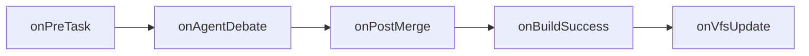
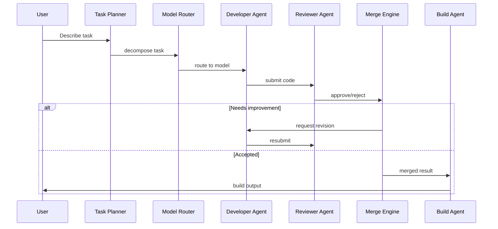

# Zenthorix

**AI-powered software engineering platform — build, debug, and deploy applications through natural language conversations with autonomous agents.**

[](LICENSE)
[](https://www.typescriptlang.org)
[](https://nextjs.org)
[](https://turbo.build)
[](https://pnpm.io)
[](CONTRIBUTING.md)

---

## Table of Contents

- [Introduction](#introduction)
- [Features](#features)
- [Prerequisites](#prerequisites)
- [Installation](#installation)
- [Environment Variables](#environment-variables)
- [First Launch](#first-launch)
- [Connecting AI Providers](#connecting-ai-providers)
- [Creating Your First Project](#creating-your-first-project)
- [Plugin Installation](#plugin-installation)
- [Updating Zenthorix](#updating-zenthorix)
- [Troubleshooting](#troubleshooting)
- [Architecture](#architecture)
- [Repository Structure](#repository-structure)
- [Technology Stack](#technology-stack)
- [Plugin System](#plugin-system)
- [Multi-Agent Workflow](#multi-agent-workflow)
- [Token Optimization](#token-optimization)
- [Security](#security)
- [Performance](#performance)
- [Development](#development)
- [Contributing](#contributing)
- [Roadmap](#roadmap)
- [FAQ](#faq)
- [License](#license)
- [Acknowledgements](#acknowledgements)

---

## Introduction

Zenthorix is an open-source, AI-native development environment. Instead of writing code line by line, you describe what you want in natural language and a team of autonomous AI agents plans, implements, reviews, tests, and deploys it.

**Why Zenthorix?**

- **Multi-agent orchestration** — Specialized agents (planner, developer, reviewer, security, tester, debugger, devops) collaborate on tasks, debate solutions, and merge results.
- **Provider-agnostic** — Swap between OpenAI, Anthropic, DeepSeek, OpenRouter, or local models via Ollama without changing your workflow.
- **Built for extensibility** — Plugin hooks at every lifecycle stage and a typed SDK for custom agents and integrations.
- **Token-aware** — Semantic caching, AST compression, budget enforcement, and context summarization keep API costs predictable.

Zenthorix is early-stage and evolving rapidly. Some UI surfaces render mock data while the underlying engine and services are production-grade.

---

## Features

| Category | Feature | Status |
|----------|---------|--------|
| **Multi-Agent AI** | Task planner, developer, reviewer, debugger, tester, security scanner, optimizer, debater, devops, UX, API consumption, custom agent | Implemented |
| **Multi-Agent AI** | State machine with 9 states, 12 events, guardrails | Implemented |
| **Multi-Agent AI** | Agent memory manager (short-term, capped at 100 entries) | Implemented |
| **Multi-Agent AI** | MapReduce for parallel task execution | Implemented |
| **Multi-Agent AI** | Model routing by task complexity and context window | Implemented |
| **Multi-Agent AI** | CVE dependency scanner | Implemented |
| **Multi-Agent AI** | Release changelog generator from conventional commits | Implemented |
| **AI Providers** | OpenAI (generate + stream) | Implemented |
| **AI Providers** | Anthropic / Claude (generate + stream) | Implemented |
| **AI Providers** | DeepSeek (generate + stream) | Implemented |
| **AI Providers** | OpenRouter (generate + stream) | Implemented |
| **AI Providers** | Ollama / local models (generate + stream + listModels) | Implemented |
| **AI Providers** | Unified provider interface via `@zenthorix/provider-sdk` | Implemented |
| **Token Optimization** | Token estimation and cost calculation per model | Implemented |
| **Token Optimization** | Daily budget enforcement with cost tracking | Implemented |
| **Token Optimization** | Semantic cache (TTL-based, max 1,000 entries) | Implemented |
| **Token Optimization** | AST compression (structural code extraction) | Implemented |
| **Token Optimization** | Context summarization (old-message truncation) | Implemented |
| **Token Optimization** | Prompt optimization (whitespace normalization, minification) | Implemented |
| **Token Optimization** | Knowledge ingestion (file chunking, 512-token windows) | Implemented |
| **Token Optimization** | Retrieval engine (keyword-based, top-K scoring) | Implemented |
| **Plugin System** | Plugin interface with 5 lifecycle hooks | Implemented |
| **Plugin System** | Plugin registry (register, unregister, query by hook) | Implemented |
| **Plugin System** | Example linter plugin (auto-whitespace cleanup) | Implemented |
| **Plugin System** | Asset generator plugin interface | Interface only |
| **Plugin System** | Plugin marketplace UI with install flow | Planned |
| **IDE** | File tree with expand/collapse, active file highlighting | Implemented |
| **IDE** | Virtual file system (read, write, delete, patch, snapshots, history) | Implemented |
| **IDE** | Code editor (textarea-based, no syntax highlighting) | Implemented |
| **IDE** | Multi-tab editor with dirty-file indicators | Implemented |
| **IDE** | Side-by-side diff viewer with accept/reject | Implemented |
| **IDE** | File history with snapshot comparison | Implemented |
| **IDE** | Drag-and-drop file upload | Implemented |
| **IDE** | Dark/light/system theme toggle | Implemented |
| **IDE** | Preview panel (iframe-based) | Implemented |
| **IDE** | File search panel | Implemented |
| **IDE** | Code format on save (JSON pretty-print, trailing newline) | Implemented |
| **IDE** | In-memory linter (debugger/var warnings) | Implemented |
| **Chat** | Chat interface with message bubbles | Mock |
| **Chat** | Streaming response simulation | Mock |
| **Chat** | Command palette (Cmd+K, file/build/theme/settings) | Implemented |
| **Chat** | Context inspector (full prompt view) | Implemented |
| **Terminal** | Tabbed multi-terminal UI | Implemented |
| **Terminal** | Command input with scrollable history | Mock |
| **Terminal** | Terminal session tracking (API) | Implemented |
| **Collaboration** | CRDT document sync (key-value, observer pattern) | Implemented |
| **Collaboration** | CRDT sync server (per-workspace broadcast) | Implemented |
| **Collaboration** | Remote cursor indicators | Implemented |
| **Collaboration** | Inline review comments (error/warning/info badges) | Implemented |
| **Collaboration** | Merge conflict detection and resolution | Implemented |
| **Collaboration** | Shared workspace state via Zustand stores | Implemented |
| **Deployment** | Vercel deploy service (project + deployment via API) | Implemented |
| **Deployment** | Docker security constraint builder | Implemented |
| **Deployment** | Git operations (branch creation, PR) via GitHub API | Implemented |
| **Deployment** | GitHub import (repository tree + file extraction) | Implemented |
| **Deployment** | Project scaffolding from templates (Next.js, Express) | Implemented |
| **Deployment** | One-click deployment UI | Planned |
| **Security** | AES-256-GCM encryption with scrypt key derivation | Implemented |
| **Security** | GitHub OAuth (NextAuth v5, JWT sessions) | Implemented |
| **Security** | Role-based access control (owner, admin, member, viewer) | Implemented |
| **Security** | Row-level security policies for conversations | Implemented |
| **Security** | API rate limiting (per-window bucket, 100/min default) | Implemented |
| **Security** | Secrets management and injection | Implemented |
| **Security** | API key storage (sessionStorage frontend, encrypted DB backend) | Implemented |
| **UX** | Notification center (global store, dropdown with badge) | Implemented |
| **UX** | Settings dialog (theme, API keys, budget) | Implemented |
| **UX** | Agent builder form (name, role, prompt, model) | Implemented |
| **UX** | Visual canvas (draggable nodes, React Flow-ready) | Stub |
| **UX** | Accessibility label constants | Implemented |
| **UX** | Panel error boundaries with reload | Implemented |
| **UX** | Branch selector (git mock) | Implemented |
| **UX** | Internationalization (en, es JSON files) | Data only |
| **Developer Tools** | Snippet manager (in-memory CRUD with search) | Implemented |
| **Developer Tools** | Knowledge base service (add, search, delete entries) | Implemented |
| **Developer Tools** | Search engine (full-text file search) | Implemented |
| **Developer Tools** | Coverage service (line/branch/function coverage) | Implemented |
| **Developer Tools** | Inline completion service (API client with cache) | Service only |
| **Developer Tools** | Public share service (snippets with TTL) | Implemented |
| **Developer Tools** | Voice input (MediaRecorder recording) | Implemented |
| **Developer Tools** | Offline detection with change subscription | Implemented |
| **Developer Tools** | Hibernation manager (session TTL, periodic cleanup) | Implemented |
| **Developer Tools** | Local auth service (SHA-256, fallback) | Implemented |
| **Developer Tools** | WebContainer service (StackBlitz-compatible API) | Stub |
| **Backend** | Fastify API server with CORS | Implemented |
| **Backend** | 21 API services (billing, build-runner, cache, git, webhooks, etc.) | Implemented |
| **Backend** | Drizzle ORM + SQLite (9 tables, indexes, cascade deletes) | Implemented |
| **Backend** | Event bus (typed publish-subscribe) | Implemented |
| **Backend** | Task cancellation | Implemented |
| **Testing** | Vitest unit test (session utility) | 1 test |
| **Testing** | Playwright e2e test (IDE + chat load) | 1 test |
| **Monitoring** | Usage analytics page (spend, tokens, charts) | Mock |
| **Monitoring** | System admin page (connections, queue, memory) | Mock |
| **Monitoring** | Plugin marketplace page (install, search) | Mock |
| **Desktop** | Tauri scaffold (Cargo.toml, conf, lib.rs) | Implemented |
| **Database** | User, account, session, API keys, conversations, messages, VFS snapshots, prompt cache | Implemented |

---

## Prerequisites

| Requirement | Version | Notes |
|-------------|---------|-------|
| **Operating Systems** | macOS, Windows, Linux | Developed and tested on macOS and Linux |
| **Node.js** | >= 22 | Required by all packages. Older versions are not supported. |
| **pnpm** | >= 10 | The monorepo uses pnpm workspaces. npm and Yarn are not supported. |
| **Git** | >= 2.0 | Required for cloning the repository |
| **Docker** | Not required | Docker is **not** required to run Zenthorix. A `DockerSecurity` utility class exists in the codebase for building container security policies, but no Docker configuration or containerization is implemented. |

### Recommended Tools

- **Chrome** or **Firefox** for the best IDE experience
- **nvm** or **fnm** for managing multiple Node.js versions

---

## Installation

### Step 1: Install Node.js

Zenthorix requires **Node.js 22 or later**. Download it from the official website:

- **macOS**: `brew install node@22`
- **Linux**: Use `nvm install 22` or your package manager
- **Windows**: Download from [nodejs.org](https://nodejs.org)

Verify your installation:

```bash
node --version
# Should print v22.x.x or higher
```

### Step 2: Install pnpm

pnpm is the only supported package manager. Install it globally:

```bash
npm install -g pnpm@10.4.0
```

Verify:

```bash
pnpm --version
# Should print 10.4.0
```

> Zenthorix was developed with pnpm 10.4.0. While newer versions may work, 10.4.0 is the tested version.

### Step 3: Clone the Repository

```bash
git clone https://github.com/Astitva8292/Zenthorix.git
cd Zenthorix
```

### Step 4: Install Dependencies

```bash
pnpm install
```

This installs all dependencies for all 11 workspace packages. The first install takes 30-60 seconds depending on your network speed.

### Step 5: Configure Environment Variables

```bash
cp .env.example .env
```

Open `.env` in any editor and fill in the values (see [Environment Variables](#environment-variables) below).

At minimum, for the IDE to start, you need:

```
AUTH_SECRET=your-secret-here
AUTH_GITHUB_ID=placeholder-oauth-client-id
AUTH_GITHUB_SECRET=placeholder-oauth-client-secret
```

The `AUTH_SECRET` can be any random string (generate one with `openssl rand -base64 32`). The GitHub OAuth values can be placeholder strings for local development — the IDE will load without authentication, though the login page will redirect to GitHub.

### Step 6: Start the Development Server

```bash
pnpm --filter=web dev
```

You will see:

```
> web@0.1.0 dev apps/web
> next dev

  ▲ Next.js 15.5.19
  - Local: http://localhost:3000
```

> The first compilation takes 30-40 seconds. Subsequent refreshes are near-instant.

### Step 7: Open the Application

Open **http://localhost:3000** in your browser. The Zenthorix IDE loads with a three-panel layout: file explorer on the left, editor in the center, and terminal at the bottom.

---

## Environment Variables

The following environment variables are read from the `.env` file located in the project root.

| Variable | Required | Description | Example |
|----------|----------|-------------|---------|
| `AUTH_SECRET` | **Yes** | NextAuth encryption secret. Used to sign JWT tokens. Generate with `openssl rand -base64 32`. | `skJF72H...` |
| `AUTH_GITHUB_ID` | **Yes** | GitHub OAuth App client ID. Required for login to work. | `Ov23li...` |
| `AUTH_GITHUB_SECRET` | **Yes** | GitHub OAuth App client secret. Required for login to work. | `a1b2c3d4...` |
| `NEXTAUTH_URL` | Optional | The canonical URL of the site. Defaults to `http://localhost:3000`. | `http://localhost:3000` |
| `DATABASE_URL` | Optional | SQLite database file path. Defaults to `file:local.db`. | `file:local.db` |
| `ENCRYPTION_KEY` | Optional | AES-256 key (32 characters) used for encrypting sensitive data. If not set, a default key is used. | `a1b2c3d4e5f6g7h8i9j0...` |
| `OPENAI_API_KEY` | Stored in UI | OpenAI API key. Also accepted in `.env` but primarily configured through the Settings dialog. | `sk-...` |
| `ANTHROPIC_API_KEY` | Stored in UI | Anthropic API key. Also accepted in `.env` but primarily configured through the Settings dialog. | `sk-ant-...` |
| `DEEPSEEK_API_KEY` | Reference only | DeepSeek API key. Listed in `.env.example` for reference. Configured through the Settings dialog in a future update. | `sk-...` |
| `OPENROUTER_API_KEY` | Reference only | OpenRouter API key. Listed in `.env.example` for reference. Configured through the Settings dialog in a future update. | `sk-or-...` |

> **Important**: The `AUTH_GITHUB_ID` and `AUTH_GITHUB_SECRET` are validated at build time. If they are missing or empty, the page generation will fail with `Missing required environment variable: AUTH_GITHUB_ID`. Use placeholder values for local development if you do not have a GitHub OAuth App set up.

### Setting Up GitHub OAuth (for Login)

1. Go to https://github.com/settings/developers
2. Click **New OAuth App**
3. Set **Homepage URL** to `http://localhost:3000`
4. Set **Authorization callback URL** to `http://localhost:3000/api/auth/callback/github`
5. Copy the **Client ID** and **Client Secret** into your `.env` file

---

## First Launch

### What You See

When you open http://localhost:3000 for the first time, you see the **Zenthorix IDE** workspace:

```
┌─────────────────────────────────────────────────┐
│  Explorer    │  Welcome to Zenthorix       │ Terminal │
│  ─────────   │                              │         │
│  ○ src/      │  (empty editor area)         │ $       │
│  ○ package   │                              │         │
│  ○ tsconfig  │                              │         │
├──────────────┼──────────────────────────────┴─────────┤
│              │                                        │
└──────────────┴────────────────────────────────────────┘
```

### The Layout

The IDE is divided into three resizable panels:

- **Left sidebar (Explorer)** — File tree with mock files. Use the gear icon at the bottom to open **Settings** (theme, API keys, budget).
- **Center (Editor)** — The main workspace area. Shows file tabs when files are open. The command palette is accessible via **Cmd+K**.
- **Bottom (Terminal)** — A mock terminal with a `$` prompt. Type commands to see simulated output.

### Login

Clicking the user icon or navigating to http://localhost:3000/login shows the **Sign in with GitHub** button. Authentication is handled via NextAuth v5 with GitHub OAuth. If you have configured valid GitHub OAuth credentials, clicking the button redirects you to GitHub for authorization.

Without valid GitHub OAuth credentials, you can still use the IDE — login is optional for local development.

### Dashboard

Navigate to http://localhost:3000/dashboard to see a **Workspaces** page with mock project cards. Each card shows a project name, last-modified timestamp, and AI model. Click **+ New Project** to return to the IDE.

> The dashboard currently shows hardcoded mock data.

### Opening the IDE

The main IDE at http://localhost:3000 is the primary workspace. From here you can:

- Browse the file tree (mock files are pre-loaded)
- Open files by clicking them in the tree
- Type in the editor (textarea-based, no syntax highlighting yet)
- Use Cmd+K to open the command palette
- Click the bell icon for notifications
- Open Settings via the gear icon

### Starting a Chat

The **Chat Interface** is embedded in the IDE (accessible via the chat tab or panel). Type a message in the input bar at the bottom and press Enter. The assistant responds with a simulated streaming message.

> The current chat uses mock responses. Real AI agent integration is in development.

---

## Connecting AI Providers

AI providers are configured through the **Settings** dialog, accessible from the gear icon in the IDE sidebar.

### Step-by-Step

1. Click the **gear icon** in the bottom-left corner of the IDE
2. The Settings dialog opens with three tabs: **General**, **Providers**, **Budget**
3. Click the **Providers** tab
4. Enter your API key(s):
   - **OpenAI**: Your OpenAI API key (starts with `sk-...`)
   - **Anthropic**: Your Anthropic API key (starts with `sk-ant-...`)
5. Click **Save**

### Where Are Keys Stored?

API keys are stored in **`sessionStorage`** in the browser. They persist for the duration of the browser tab. When you close the tab, they are cleared. This means you need to re-enter keys each time you open Zenthorix in a new session.

> Server-side encrypted storage is implemented in the database (`api_keys` table with AES-256-GCM encryption) but the UI does not yet use it.

### Supported Providers

| Provider | Configured Via | `generate()` | `stream()` | `listModels()` |
|----------|---------------|:---:|:---:|:---:|
| **OpenAI** | Settings → Providers (OpenAI API Key field) | Yes | Yes | Yes |
| **Anthropic (Claude)** | Settings → Providers (Anthropic API Key field) | Yes | Yes | No |
| **DeepSeek** | `.env` only (no UI field yet) | Yes | Yes | No |
| **OpenRouter** | `.env` only (no UI field yet) | Yes | Yes | Yes |
| **Ollama** | No API key needed (runs locally) | Yes | Yes | Yes |

### Using Ollama Locally

If you have Ollama installed and running on `http://localhost:11434`, Zenthorix can connect to it automatically. No API key is required. Supported models include any model you have pulled in Ollama (e.g., `llama3`, `mistral`, `codellama`).

### Provider Selection

When the agent engine processes a task, the `AdaptiveRouter` selects the appropriate provider based on:

- The **model name** requested (e.g., `gpt-4o` routes to OpenAI, `claude-3.5-sonnet` routes to Anthropic)
- The **context window** required (larger contexts route to providers with bigger windows)
- The **task complexity** (simpler tasks use cheaper models)

---

## Creating Your First Project

Zenthorix is in active development, and the agent collaboration pipeline — while fully implemented in the `agent-engine` package — is not yet wired to the user interface. The following describes the current state and how to use what is available.

### What You Can Do Now

1. **Open the IDE** at http://localhost:3000
2. **Browse the file explorer** — mock files are pre-loaded in the tree
3. **Open and edit files** — click any file in the tree to open it in the editor
4. **Use the command palette** — press Cmd+K to search, switch themes, or open settings
5. **Configure AI providers** — add your OpenAI or Anthropic API keys in Settings
6. **Use the terminal** — type commands in the bottom panel
7. **View notifications** — click the bell icon

### What's Coming

The multi-agent workflow (describe → plan → code → review → merge → build → debug → deploy) is fully implemented in the `@zenthorix/agent-engine` and `@zenthorix/token-engine` packages. Once the UI wiring is complete, the flow will be:

1. Enter a prompt in the chat interface
2. The `TaskPlannerAgent` decomposes the request into subtasks
3. Specialized agents (Developer, Reviewer, Security, etc.) execute in parallel
4. The `MergeEngine` combines results
5. The `AgentStateMachine` orchestrates the 9-state workflow
6. Generated code appears in the file tree
7. The user reviews diffs and accepts changes

---

## Plugin Installation

Plugin installation is **planned** but not yet implemented.

### Current State

- The **Plugin SDK** (`@zenthorix/plugin-sdk`) is fully implemented with:
  - A `ZenthorixPlugin` interface with 5 lifecycle hooks
  - A `PluginRegistry` class for registering, unregistering, and querying plugins
  - An example `LinterPlugin` in `packages/plugins/`
- The **Plugin Marketplace** page at http://localhost:3000/marketplace renders **mock plugin data** (Tailwind Formatter, Figma to Code, Dark Theme) with "Install" buttons that do not yet function

### How It Will Work (Planned)

1. Browse the marketplace at `/marketplace`
2. Click **Install** on a plugin
3. The plugin is downloaded and registered with the `PluginRegistry`
4. Enabled plugins appear in a "Plugins" section in the IDE sidebar
5. Toggle plugins on/off from the settings panel
6. Remove plugins from the plugin manager in settings

### Building a Plugin (Currently Works)

Plugins can be built programmatically using the SDK. See the [Plugin System](#plugin-system) section for code examples.

---

## Updating Zenthorix

To update to the latest version:

```bash
# Pull the latest changes
git pull origin main

# Reinstall dependencies if package.json changed
pnpm install

# Rebuild all packages
pnpm build

# Restart the dev server
pnpm --filter=web dev
```

Check the [GitHub releases page](https://github.com/Astitva8292/Zenthorix/releases) for release notes and breaking changes.

---

## Troubleshooting

### pnpm install fails

**Error: `ERR_PNPM_OUTDATED_LOCKFILE`**

The lockfile is out of date. Run:

```bash
pnpm install --no-frozen-lockfile
```

**Error: `ERR_PNPM_NO_PKG_MANIFEST`**

You are running the command from the wrong directory. Ensure you are in the project root:

```bash
cd /path/to/Zenthorix
```

**Error: `ERR_PNPM_RECURSIVE_RUN_FIRST_FAIL` + `SIGTERM`**

A previous process is occupying the port. Kill it:

```bash
lsof -ti:3000 | xargs kill -9
```

Then retry.

### Missing environment variables

**Error: `Missing required environment variable: AUTH_GITHUB_ID`**

The build process requires these variables at page-generation time. Add placeholder values to `.env`:

```
AUTH_GITHUB_ID=placeholder-oauth-client-id
AUTH_GITHUB_SECRET=placeholder-oauth-client-secret
AUTH_SECRET=any-random-string-at-least-32-chars
```

### Authentication problems

**Login redirects to GitHub and fails**

- Ensure your GitHub OAuth App has the correct callback URL: `http://localhost:3000/api/auth/callback/github`
- Verify the Client ID and Client Secret in `.env` match the values on GitHub
- Check that `NEXTAUTH_URL` is set to `http://localhost:3000`

**Login page shows "Sign in with GitHub" but nothing happens**

Ensure the `.env` file has valid AUTH_GITHUB_ID and AUTH_GITHUB_SECRET values. Without them, `next build` will fail.

### Build errors

**Error: `Type 'unknown' is not assignable to type`**

This occurs in packages that use `strict: true` with no DOM types. The API package `apps/api` uses `"lib": ["ES2022"]` without `"dom"`, so `res.json()` returns `unknown`. All such cases should use `as` type assertions.

If you encounter these errors, check that type assertions (`as Type`) are used after `await res.json()` calls.

**`pnpm build` fails with no clear error**

Build each package individually to identify the failing package:

```bash
pnpm --filter=@zenthorix/provider-sdk build
pnpm --filter=@zenthorix/core build
pnpm --filter=@zenthorix/agent-engine build
pnpm --filter=@zenthorix/token-engine build
pnpm --filter=@zenthorix/database build
pnpm --filter=@zenthorix/plugin-sdk build
pnpm --filter=@zenthorix/ui build
pnpm --filter=web build
pnpm --filter=api build
```

### Provider connection failures

**OpenAI / Anthropic / DeepSeek / OpenRouter returns errors**

- Verify your API key is entered correctly in Settings (no extra spaces)
- Check that your API key has sufficient credits/quota
- Ensure your network can reach the provider's API endpoint
- For OpenRouter, verify you can reach `https://openrouter.ai/api/v1/chat/completions`

**Ollama connection refused**

- Ensure Ollama is running: `ollama serve`
- Verify the default URL: `http://localhost:11434`
- Check that you have pulled a model: `ollama pull llama3`

### Dev server hangs

**`next dev` shows no output after "Starting..."**

- Ensure you are using Node.js 22 or later. Node.js 26+ is not yet supported by Next.js 15.5.19.
- Check that port 3000 is not in use by another process
- Delete the `.next` cache: `rm -rf apps/web/.next` and retry

---

## Architecture


---

## Repository Structure

```
zenthorix/
├── apps/
│   ├── web/                        # Next.js 15 frontend (IDE, auth, pages)
│   │   ├── src/
│   │   │   ├── app/                # App Router pages (/, /login, /dashboard, /analytics, /admin, /marketplace)
│   │   │   ├── components/         # React components (editor, chat, terminal, explorer, settings, canvas, etc.)
│   │   │   ├── services/           # Client-side services (inline-completion, voice-input, webcontainer, etc.)
│   │   │   ├── lib/                # Utilities (session, stores, snippet-manager, a11y)
│   │   │   └── i18n/               # Internationalization JSON (en, es)
│   │   └── src-tauri/              # Tauri desktop scaffold (Cargo.toml, lib.rs)
│   └── api/                        # Fastify API server
│       └── src/
│           ├── index.ts             # Server entry (health, agents, workspaces routes)
│           └── services/           # 21 services (billing, git, github, build-runner, queue, etc.)
│
├── packages/
│   ├── core/                       # Shared logic
│   │   └── src/
│   │       ├── providers/          # AI provider implementations (OpenAI, Anthropic, DeepSeek, OpenRouter, Ollama)
│   │       ├── vfs/                # Virtual file system (read, write, patch, snapshots, history)
│   │       ├── crdt/               # CRDT document sync
│   │       ├── auth/               # RBAC (roles, permissions)
│   │       ├── stores/             # Zustand stores (workspace, appearance, keybindings)
│   │       ├── events/             # Typed event bus
│   │       ├── encryption.ts       # AES-256-GCM
│   │       ├── search-engine.ts    # Full-text search
│   │       ├── knowledge-base.ts   # Knowledge base service
│   │       ├── coverage-service.ts # Code coverage
│   │       └── conflict-resolver.ts# Merge conflict detection
│   │
│   ├── agent-engine/               # Multi-agent orchestration
│   │   └── src/
│   │       ├── agent.ts            # BaseAgent (template method: execute -> doExecute)
│   │       ├── state-machine.ts    # 9-state FSM with guardrails
│   │       ├── planner-agent.ts    # Task decomposition
│   │       ├── developer-agent.ts  # Code generation
│   │       ├── reviewer-agent.ts   # Code review
│   │       ├── security-agent.ts   # Vulnerability scanning
│   │       ├── debugger-agent.ts   # Error diagnosis
│   │       ├── test-agent.ts       # Test generation
│   │       ├── optimizer-agent.ts  # Performance suggestions
│   │       ├── debate-agent.ts     # Proposal comparison
│   │       ├── merge-engine.ts     # Result merging
│   │       ├── adaptive-router.ts  # Model selection by context
│   │       ├── map-reduce.ts       # Parallel task execution
│   │       ├── memory-manager.ts   # Short-term memory (100 entries)
│   │       ├── cve-scanner.ts      # npm dependency CVE scan
│   │       ├── release-agent.ts    # Changelog generation
│   │       └── ...                 # DevOps, UX, API Consumption, Custom agents
│   │
│   ├── token-engine/               # Token optimization
│   │   └── src/
│   │       ├── token-estimator.ts  # Per-model token counting
│   │       ├── cost-estimator.ts   # Cost calculation
│   │       ├── budget-enforcer.ts  # Daily spend caps + context truncation
│   │       ├── semantic-cache.ts   # TTL-based response cache
│   │       ├── ast-compressor.ts   # Structural code compression
│   │       ├── summarizer.ts       # Context summarization
│   │       ├── prompt-optimizer.ts # Whitespace/filler removal
│   │       ├── knowledge-ingester.ts # File chunking
│   │       └── retrieval-agent.ts  # Keyword-based retrieval
│   │
│   ├── provider-sdk/               # Provider interface and base class
│   │   └── src/
│   │       ├── types.ts            # ChatCompletionMessage, ModelInfo, TokenUsage, etc.
│   │       ├── base-provider.ts    # Abstract BaseProvider
│   │       └── model-costs.ts      # Model cost map (8 models)
│   │
│   ├── plugin-sdk/                 # Plugin system
│   │   └── src/
│   │       ├── index.ts            # ZenthorixPlugin interface, PluginRegistry
│   │       └── asset-generator.ts  # AssetGeneratorPlugin interface
│   │
│   ├── plugins/                    # Concrete plugin implementations
│   │   └── src/
│   │       └── linter-plugin.ts    # Auto-linter (onPostMerge hook)
│   │
│   ├── database/                   # Database schema and client
│   │   └── src/
│   │       ├── schema.ts           # 9 tables (users, accounts, sessions, api_keys, etc.)
│   │       ├── index.ts            # createDbClient, seedDatabase
│   │       ├── rls-policies.ts     # Row-level security policies
│   │       └── seed.ts             # Database seed script
│   │
│   └── ui/                         # Shared React components
│       └── src/
│           └── components/
│               ├── button.tsx      # Polymorphic Button (primary/secondary/ghost, sm/md/lg)
│               └── theme-toggle.tsx# Dark/light theme toggle
│
├── docs/                           # Documentation
│   ├── MASTER.md                   # Project master plan
│   └── Architecture.md             # Architecture documentation
│
├── e2e/                            # Playwright end-to-end tests
├── scripts/                        # Build scripts (esbuild)
├── turbo.json                      # Turborepo pipeline configuration
└── package.json                    # Workspace root
```

---

## Technology Stack

| Layer | Technology |
|-------|-----------|
| **Frontend** | [Next.js 15](https://nextjs.org) (App Router, React 19), [Tailwind CSS v4](https://tailwindcss.com) |
| **Backend** | [Fastify](https://fastify.dev) (Node.js 22+, ESM) |
| **Database** | [SQLite](https://sqlite.org) via [Drizzle ORM](https://orm.drizzle.team) ([LibSQL](https://turso.tech/libsql)) |
| **State Management** | [Zustand](https://github.com/pmndrs/zustand) |
| **Authentication** | [NextAuth v5](https://next-auth.js.org) (beta) with GitHub OAuth, JWT sessions |
| **Build System** | [Turborepo](https://turbo.build) v2, [esbuild](https://esbuild.github.io) (packages), Webpack (Next.js) |
| **Package Manager** | [pnpm](https://pnpm.io) v10 with isolated linker |
| **Testing** | [Vitest](https://vitest.dev) (unit), [Playwright](https://playwright.dev) (e2e) |
| **Linting** | [ESLint](https://eslint.org) 9 + [typescript-eslint](https://typescript-eslint.io) |
| **AI Providers** | OpenAI, Anthropic, DeepSeek, OpenRouter, Ollama (via `@zenthorix/provider-sdk`) |
| **Desktop** | [Tauri](https://v2.tauri.app) v2 (scaffold) |
| **Deployment** | Vercel (via `VercelDeployService`) |

---

## Plugin System

Zenthorix plugins hook into the agent lifecycle at five points:



### Plugin Interface

```typescript
interface ZenthorixPlugin {
  name: string
  version: string
  hooks: PluginHook[]
  onPreTask?(context: TaskContext): Promise<void>
  onAgentDebate?(proposals: Proposal[]): Promise<Proposal[]>
  onPostMerge?(merged: Output): Promise<Output>
  onBuildSuccess?(result: BuildResult): Promise<void>
  onVfsUpdate?(update: VfsUpdate): Promise<void>
}
```

### Plugin Registry

```typescript
class PluginRegistry {
  register(plugin: ZenthorixPlugin): void
  unregister(name: string): void
  get(name: string): ZenthorixPlugin | undefined
  getAll(): ZenthorixPlugin[]
  getByHook(hook: PluginHook): ZenthorixPlugin[]
}
```

### Building a Plugin

```typescript
import { ZenthorixPlugin, PluginRegistry } from '@zenthorix/plugin-sdk'

const myPlugin: ZenthorixPlugin = {
  name: 'my-plugin',
  version: '1.0.0',
  hooks: ['onPostMerge'],
  async onPostMerge(output) {
    // Transform output here
    return output
  },
}

const registry = new PluginRegistry()
registry.register(myPlugin)
```

An example `LinterPlugin` (auto-whitespace cleanup on `onPostMerge`) is provided in `packages/plugins/`.

---

## Multi-Agent Workflow



The `AgentStateMachine` enforces this flow with 9 states (`idle -> planning -> proposing -> reviewing -> merging -> building -> debugging -> success | error`) and guardrails including a maximum of 5 review cycles.

---

## Token Optimization

| Component | Description |
|-----------|-------------|
| **Token Estimator** | Counts tokens per model using model-specific encoding assumptions |
| **Cost Estimator** | Calculates cost per request using per-model input/output rates |
| **Budget Enforcer** | Tracks daily accumulated cost and truncates context when approaching limits |
| **Semantic Cache** | Caches query-response pairs with TTL expiration (30 min, max 1,000 entries) |
| **AST Compressor** | Extracts structural signatures (imports, type definitions, function signatures) from source code, targeting 1,000-to-50 line compression |
| **Context Summarizer** | Preserves system prompt and most recent messages while summarizing older history |
| **Prompt Optimizer** | Normalizes whitespace, minifies JSON, removes filler words |
| **Knowledge Ingestion** | Splits files into 512-token overlapping chunks for retrieval |
| **Retrieval Engine** | Keyword-based chunk retrieval with top-K scoring by term overlap |

---

## Security

| Layer | Implementation |
|-------|---------------|
| **Encryption** | AES-256-GCM with scrypt key derivation. `encrypt(text)` / `decrypt(encoded)` functions in `@zenthorix/core` |
| **Authentication** | GitHub OAuth via NextAuth v5, JWT sessions with custom callback |
| **Authorization** | RBAC with 4 roles (owner, admin, member, viewer) and granular permissions (`read`, `write`, `delete`, `manage_members`, `manage_billing`, `dispatch_agents`) |
| **Row-Level Security** | RLS policies enforce per-user data isolation on conversations table |
| **Rate Limiting** | In-memory windowed bucket limiter (100/min standard, 20/min for agent endpoints) |
| **Secrets Management** | Encrypted API key storage in database (`api_keys` table), sessionStorage for frontend |
| **Docker Security** | Per-phase resource constraints (memory, CPU, timeout, network policies) |

---

## Performance

- **Streaming** — All AI providers support `AsyncIterable<string>` streaming for real-time token delivery.
- **Semantic Cache** — Repeated queries return cached responses, avoiding redundant API calls.
- **AST Compression** — Reduces code context by ~95% (1,000 -> 50 lines) via structural extraction.
- **Virtual File System** — In-memory file operations with snapshot-based history (max 20 snapshots).
- **Selective Context** — Only active file content is sent in full; compressed signatures for inactive files.
- **Budget Enforcement** — Prevents runaway costs by truncating context and capping daily spend.
- **Adaptive Routing** — Routes requests to models with sufficient context window, reducing fallback retries.

---

## Development

```bash
# Build all packages
pnpm build

# Start web dev server
pnpm --filter=web dev

# Start API dev server
pnpm --filter=api dev

# Lint all packages
pnpm lint

# Type-check all packages
pnpm typecheck

# Run tests
cd apps/web && pnpm vitest run    # Unit tests
cd e2e && pnpm playwright test    # E2E tests

# Clean build artifacts
pnpm clean
```

---

## Contributing

Contributions are welcome. Zenthorix is in active development and there are many areas where help is needed.

### Getting Started

1. Fork the repository
2. Create a feature branch (`git checkout -b feat/my-feature`)
3. Make your changes
4. Ensure all packages build (`pnpm build`)
5. Commit with a conventional commit message (`feat:`, `fix:`, `docs:`, etc.)
6. Push to your fork and open a pull request

### Areas for Contribution

- **Wiring the agent engine to the chat UI** — The agent engine is fully implemented but not connected to the frontend
- **Adding syntax highlighting** — Replace the textarea editor with CodeMirror or Monaco
- **Real terminal emulation** — Integrate xterm.js with a real PTY backend
- **Expanding test coverage** — The current test suite is minimal
- **CI/CD pipeline** — Set up GitHub Actions for automated testing
- **New AI providers** — Implement the `IZenthorixProvider` interface for additional providers

### Guidelines

- Follow the existing code style — the ESLint config enforces TypeScript conventions
- Use conventional commits (`feat:`, `fix:`, `docs:`, `refactor:`, `test:`, etc.)
- Add tests for new functionality
- Update the README if you change APIs or add features

---

## Roadmap

### Completed

- [x] Multi-agent engine with 12 agent types and state machine
- [x] 5 AI provider implementations (OpenAI, Anthropic, DeepSeek, OpenRouter, Ollama)
- [x] Provider SDK with unified interface and cost model map
- [x] Token optimization engine (estimation, caching, compression, budget, summarization)
- [x] Plugin SDK with lifecycle hooks and registry
- [x] Database schema with Drizzle ORM (9 tables, RLS, cascade deletes, indexes)
- [x] Virtual file system with snapshot history
- [x] AES-256-GCM encryption
- [x] RBAC with 4 roles and permission matrix
- [x] NextAuth v5 with GitHub OAuth and JWT sessions
- [x] CRDT document sync with broadcast server
- [x] Merge conflict detection and resolution
- [x] Notification center with global store
- [x] Inline code review comments
- [x] Side-by-side diff viewer
- [x] i18n data files (en, es)
- [x] Tauri desktop scaffold
- [x] Fastify API with 21 services
- [x] 9/9 Turbo tasks building with zero errors

### In Progress

- [ ] Wiring i18n runtime into UI components
- [ ] Syntax highlighting in code editor (CodeMirror / Monaco)
- [ ] Real terminal emulation (xterm.js)
- [ ] WebContainer integration for in-browser execution
- [ ] Real-time collab (operational transform)
- [ ] Comprehensive test suite
- [ ] CI/CD pipeline (GitHub Actions)

### Planned

- [ ] Chat-to-agent-engine integration
- [ ] Plugin marketplace with install flow
- [ ] Visual canvas with React Flow
- [ ] Voice transcription (speech-to-text)
- [ ] Vector database for knowledge base retrieval
- [ ] Desktop builds via Tauri
- [ ] Deployment presets (Vercel, Docker, AWS)
- [ ] Agent memory persistence to database
- [ ] Multi-workspace support
- [ ] VS Code extension

---

## FAQ

**Can I use my own API keys?**
Yes. API keys for OpenAI and Anthropic are configured through the Settings dialog (gear icon in the IDE). DeepSeek and OpenRouter keys are in `.env.example` but do not yet have a UI field. Ollama requires no API key.

**Does Zenthorix work offline?**
Partially. The IDE itself (file tree, editor, terminal UI, command palette, notifications) works offline. AI features require API access to one of the supported providers. Ollama can run entirely locally for offline AI features.

**Which AI providers are supported?**
OpenAI, Anthropic (Claude), DeepSeek, OpenRouter, and Ollama. All five implement both `generate()` and `stream()`. See the [Connecting AI Providers](#connecting-ai-providers) section.

**Can I use Ollama locally?**
Yes. Run `ollama serve` on your machine and Zenthorix connects automatically at `http://localhost:11434`. Pull any model (e.g., `ollama pull llama3`) and it appears in the model list.

**Is Docker required?**
No. Docker is not required to run Zenthorix. The codebase includes a `DockerSecurity` utility class for building container security policies, but no Docker configuration or containerization is implemented.

**Does Zenthorix collect my API keys?**
No. API keys are stored in `sessionStorage` in your browser (cleared when you close the tab) or in a local SQLite database with AES-256-GCM encryption. No data is sent to any server beyond the AI provider APIs you configure.

**Can I build my own agent?**
Yes. Use the `CustomAgent` class or extend `BaseAgent` and override `doExecute()`. Custom agents can be registered with the engine and invoked by name.

**Is there a hosted version?**
Not yet. Zenthorix is self-hosted. Deployment services (Vercel, Docker) are available as code-level integrations but no hosted platform exists.

**How do I update Zenthorix?**
Pull the latest changes from the repository and rebuild. See [Updating Zenthorix](#updating-zenthorix) for detailed instructions.

**Can I contribute?**
Yes. See the [Contributing](#contributing) section for guidelines.

---

## License

[MIT](LICENSE)

---

## Acknowledgements

Zenthorix builds on the work of many open-source projects:

- [Next.js](https://nextjs.org) and [React](https://react.dev) — Frontend framework
- [Turborepo](https://turbo.build) — Monorepo orchestration
- [pnpm](https://pnpm.io) — Package management
- [Drizzle ORM](https://orm.drizzle.team) — Database toolkit
- [NextAuth.js](https://next-auth.js.org) — Authentication
- [Fastify](https://fastify.dev) — Node.js web framework
- [Zustand](https://github.com/pmndrs/zustand) — State management
- [Tailwind CSS](https://tailwindcss.com) — Utility-first CSS
- [esbuild](https://esbuild.github.io) — Fast JavaScript bundler
- [Vitest](https://vitest.dev) and [Playwright](https://playwright.dev) — Testing
- [Tauri](https://v2.tauri.app) — Desktop application framework
- [TypeScript](https://typescriptlang.org) — Language
- [ESLint](https://eslint.org) and [Prettier](https://prettier.io) — Code quality
